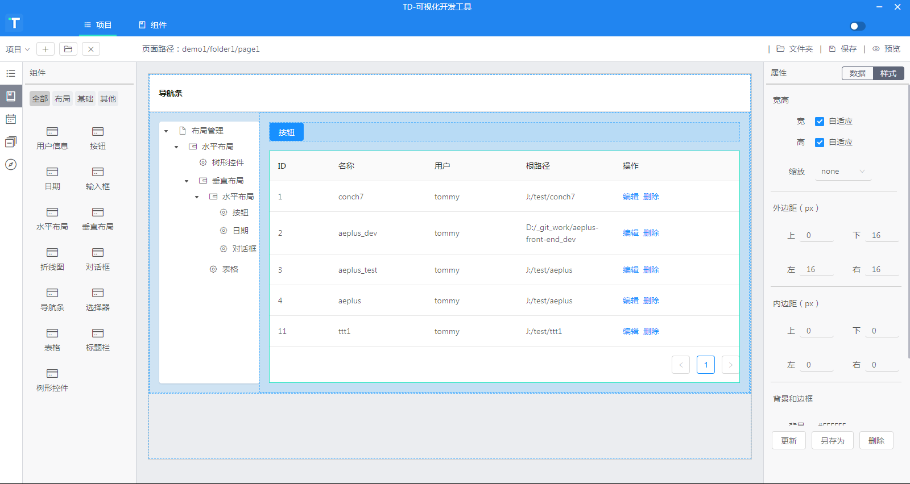

### 可视化代码生成工具
- 可创建工程，拖拽组件布局页面，一键生成项目代码。
- 

##### 安装

###### 从git克隆代码:
- https://github.com/irsv67/conch.git
- master 分支

###### 安装依赖
- npm install

###### 拷贝资源文件
- 将 res/_conch_res.zip 解压到用户根目录（win7：C:/Users/your_name/_conch_res）

##### 启动开发模式

###### 构建前端代码并监视文件改动
- npm run watch-frontend

###### 构建后端代码并监视文件改动
- npm run watch-backend

###### 在默认模式下运行electron
- npm run start-ele

##### 构建项目为桌面可执行程序

###### windows环境下运行electron打包脚本：
- npm run package
- 在项目根目录的上一级会有 OutApp-win 文件夹，内有可执行程序

###### mac环境下运行electron打包脚本：
- npm run package-mac
- 在项目根目录的上一级会有 OutApp-mac 文件夹，内有可执行程序

